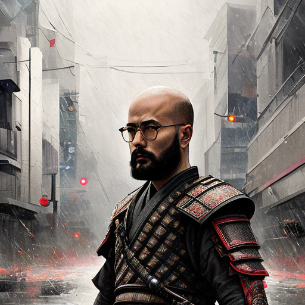
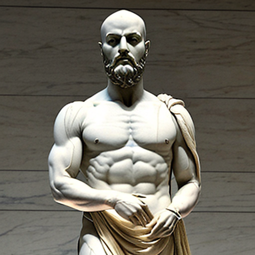
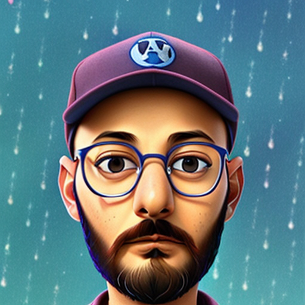
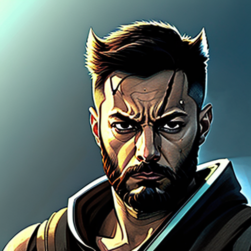
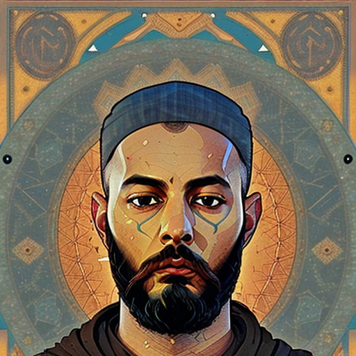
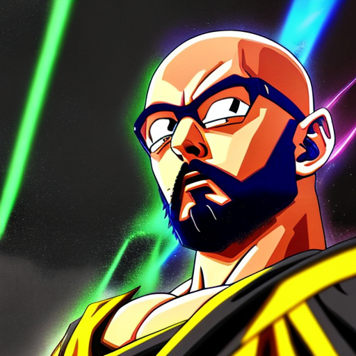
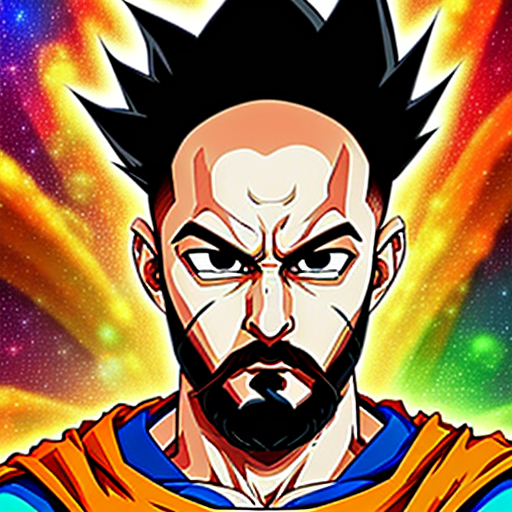
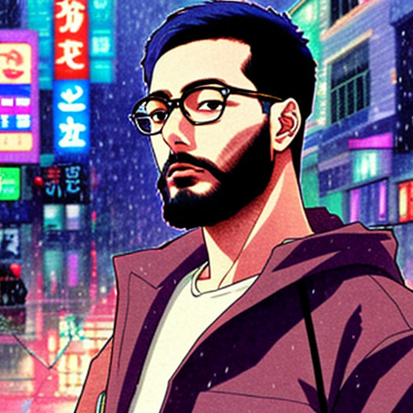

# Stable Diff-usuf

Fine-Tuning Stable Diffusion 1.5 and running inference from HuggingFace Endpoint

Sample pictures of this concept:

TODO:
[ ] Continue refactor, get main logic out of notebook
[ ] Use Ray Serve to serve with GPU from JarvisAI Labs environment
      
